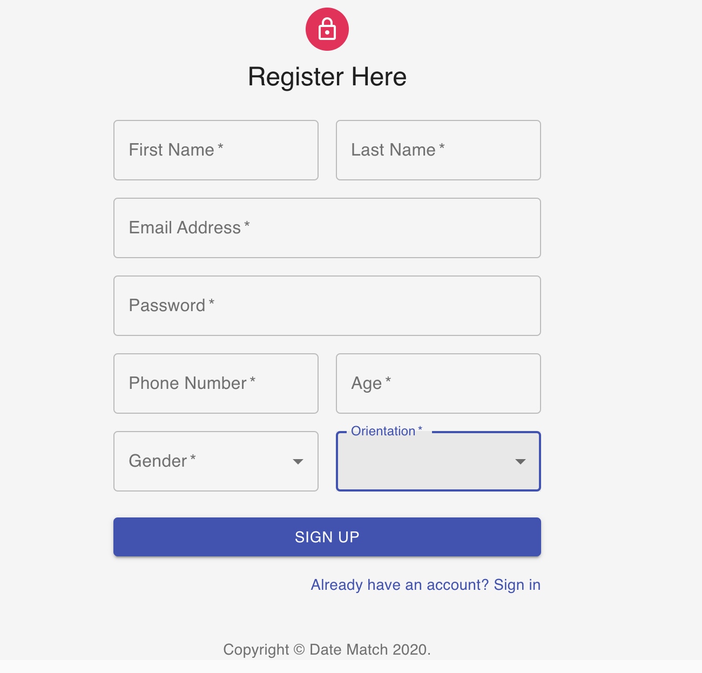
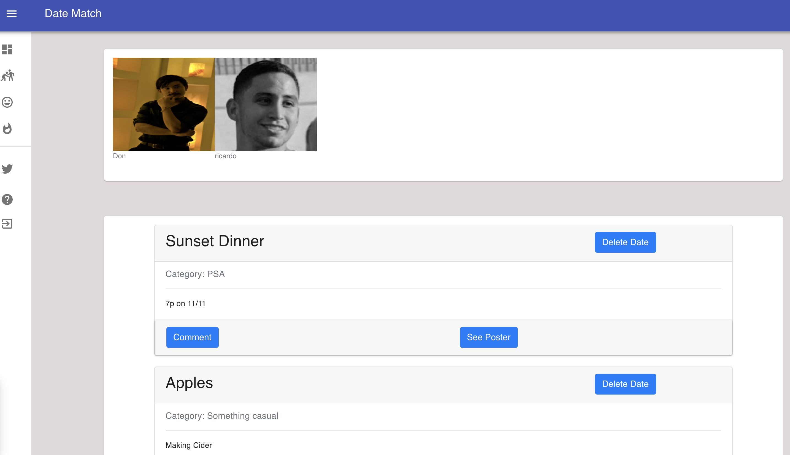
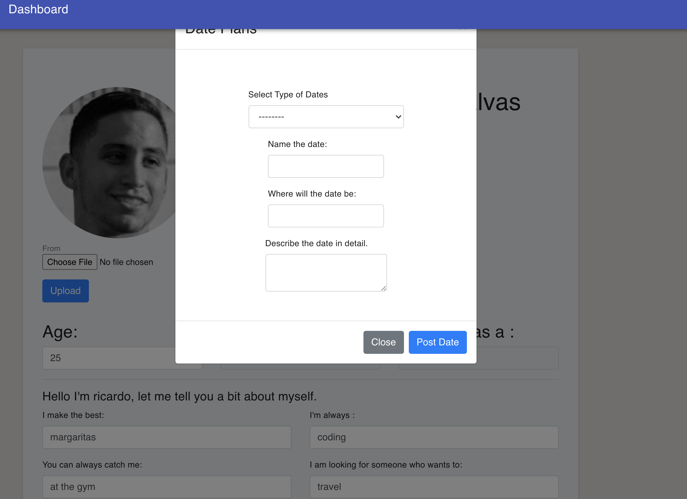
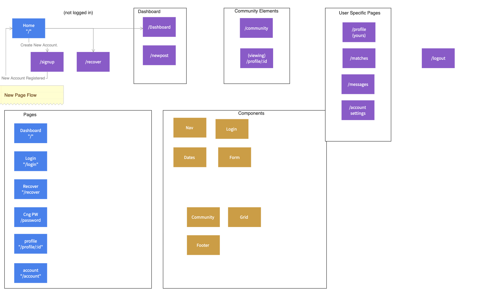

  # Data Match
  
  ## Description
  This is a dating site to help connect people. A user will post a date that they wish to take someone on. Other users can browse through the posted dates and notify the poster if they are interested in the date. Users can see the profiles of those who have expressed interest in their date posts. Welcome and enjoy!
  ### Table of contents
  1. [Description](#Description)
  2. [Table of Contents](#Table-of-Contents)
  3. [Installation](#Installation)
  4. [Usage](#Usage)
  5. [License](#License)
  6. [Contributing](#Contributing)
  7. [Tests](#Tests)
  8. [Questions](#Questions)
  
  ## Pics
  
  
  
  
  
  
  

  

  ## Installation
  npm run build
  
  ## Usage
  sign, up, sign in, make dates, find matches  
  
  ## License
  
  
  ## Contributing
  Don Tran, Ricardo Manosalvas, James Hudgins   
  
  ## Tests
  n/a
  
  ## Questions
  Questions regarding this application should be sent via email to, james.hudgins.work@gmail.com. You can also contact me on github with additional questions ->        https://github.com/rmanosalvas
